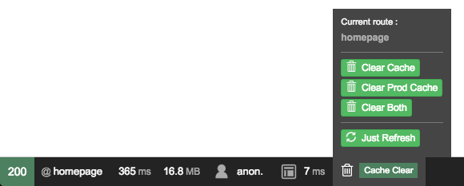

# CacheClearToolbar

CacheClearToolbar is an addon to the Symfony Web Debug Toolbar.

    The CacheClearToolbar design uses Bootstrap classes.
    If you do not use it, the CacheClearToolbar will lose his awesome adapted design. ;)

It allows you to quickly :
* See the current route name,
* Clear the dev cache and refresh the page,
* Clear the prod cache and refresh the page,
* Clear both cache and refresh the page or
* Just refresh the page.



## Usage
When the page is loaded, the Symfony Web Debug Toolbar is loaded. Just watch the last information in the Toolbar to see the CacheClearToolbar went alive.

    To use this addon, you must have, at least, the version 3.0 of Symfony.
    The addon may work on previous version but it has not been tested.

## Install

### Download from Github
* Unzip Bundle,
* Rename folder to `CacheClearToolbar`
* Move folder to `'MySymfonyProject'/src/Darkkrye/`

### Download from Composer
* Open terminal in your Symfony project folder,
* Run `composer require darkkrye/cache-clear-toolbar dev-master`

### Register into AppKernel
* Add the following code into AppKernel :
```php
// app/AppKernel.php
if (in_array($this->getEnvironment(), array('dev', 'test'))) {
    [...]
    $bundles[] = new Darkkrye\CacheClearToolbar\CacheClearToolbar();
}
```

### Add to route file
* Add the following code into main route file :
```yml
// app/config/routing.yml
cache_clear_toolbar:
    resource: "@CacheClearToolbar/Resources/config/routing.yml"
    prefix: /cache_clear_toolbar
```

### Reload
* Reload and enjoy !

## Version
The CacheClearToolbar stable current version is : 1.0

## TODO !
 - [x] Create Web Debug Toolbar tool,
 - [x] Add additional namespace,
 - [x] Release to composer,
 - [ ] Change properties to only work in dev environment,
 - [ ] Add new route to just clear the cache and close the tab,
 - [ ] Add his own css rules,
 - [ ] Create Symfony project which implements the CacheClearToolbar.